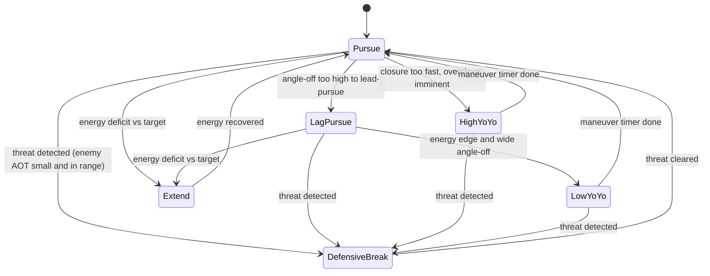

# AI Dogfight Strategy Overhaul

> **Status: implemented.** This document is the design plan for the ENGAGE-phase
> dogfight sub-state-machine added to `AiPilot`. All to-dos below were completed;
> the code lives in [src/script/ai/aiPilot.ts](../src/script/ai/aiPilot.ts) and
> [src/script/ai/dogfightGeometry.ts](../src/script/ai/dogfightGeometry.ts), with
> tests in `src/script/ai/dogfightGeometry.test.ts` and
> `src/script/ai/aiPilot.dogfight.test.ts`. Kept here as the rationale/reference
> for the design.

Give the AI opponent real basic-fighter-maneuver (BFM) decision-making — energy
management, defensive break turns, yo-yos, and disengage-to-extend — instead of
always flying straight lead-pursuit, by adding a maneuver sub-state-machine
inside the existing `ENGAGE` phase of `AiPilot`.

## Assumption (no answer given to clarifying questions)

Since the scope-narrowing questions were skipped, this plan targets a
**genuinely skilled, fair dogfighter** — it adds real tactics (energy
management, defensive maneuvers, yo-yos) tuned aggressively enough to win most
fights, while leaving a `skill` knob so it can be dialed down/up later without
another redesign. If a different intent was meant (e.g. a scripted "unbeatable
boss"), the design can be adjusted before further tuning.

## Current behavior (why the AI lost before this change)

All combat logic used to live in one method, `doEngage()`:

```ts
private doEngage(delta: number): void {
    ...
    // Gun lead solution: where the target will be when a bullet arrives.
    const tof = range / this.bulletSpeed;
    this.aim.copy(this.tvel).multiplyScalar(tof).add(this.tpos);
    ...
    this.commandHeading(desiredHeading, MAX_BANK_COMBAT);
    this.commandElevation(desiredElev);

    // Energy management: ease off when very close to avoid overshoot.
    const desiredSpeed = range < 250 ? this.combatSpeed * 0.7 : this.combatSpeed;
    this.commandSpeed(desiredSpeed, delta);

    this.firing = range <= this.gunRange && aimAngle <= GUN_CONE_RAD;
}
```

It always pointed the nose straight at the lead-pursuit aimpoint, regardless of
turn geometry, closure rate, or energy state, and it **never checked whether it
was itself being tracked/shot at** — so it never broke, never extended to
rebuild energy, and never used vertical maneuvers. This was the single method
replaced.

## New design: a maneuver sub-state-machine inside ENGAGE



### 1. Pure, testable geometry helpers — `src/script/ai/dogfightGeometry.ts`

Functions with no engine/state dependency, taking plain `THREE.Vector3`/numbers,
so they can be unit tested directly (previously there were **zero** AI tests):

- `specificEnergyHeight(altitude, speed)` — "energy height" `h + v²/(2g)`, used
  to compare the AI's total energy against the target's.
- `closureRate(myPos, myVel, targetPos, targetVel)` — signed range-rate along
  the line of sight (negative = closing).
- `trackingAngle(shooterPos, shooterForward, targetPos)` — angle between a
  shooter's nose and the line to a point; reused both for the AI's own gun
  solution (already computed inline before this change) and, with the
  **target's velocity as a nose proxy**, for detecting whether the target has a
  gun solution on the AI (its `Combatant` interface exposes only
  position/velocity, so velocity direction is used as the forward proxy —
  consistent with how the existing lead-pursuit math already treats target
  velocity as "the way it's pointed").
- `aspectAngle(observerPos, targetPos, targetVel)` — angle off the target's
  tail, used to classify offense/defense/neutral merges.
- `angleOff(myVel, targetVel)` — angle between the two flight paths, used to
  decide whether a lead-pursuit turn is flyable.

Covered by `src/script/ai/dogfightGeometry.test.ts` against known
hand-computed geometries (dead six, head-on, perpendicular, energy-advantage
cases).

### 2. Maneuver modes and transition logic — `src/script/ai/aiPilot.ts`

A `DogfightMode` enum (`PURSUE`, `LAG_PURSUE`, `HIGH_YOYO`, `LOW_YOYO`,
`DEFENSIVE_BREAK`, `EXTEND`) plus mode-timer/hysteresis state fields, following
the file's existing pattern for the terrain pull-up latch (`pullUpActive`).

`doEngage()` is now a thin dispatcher:

1. Compute shared per-frame geometry once (range, closure, angle-off, target's
   tracking angle on the AI, energy delta) via the geometry helpers.
2. `updateDogfightMode(...)` — the decision layer — evaluates transitions in
   priority order:
   - **Defensive break** (highest priority): target's `trackingAngle` on the
     AI is small AND range is inside a threat radius, sustained past a short
     reaction-delay timer (skill-dependent) → hard break turn toward the
     attacker's bearing at max bank, **does not fire**.
   - **Extend**: AI's energy height is meaningfully below the target's (and
     not already defensive) → heads away from the target, unloads, holds max
     throttle, accepts pointing off the target briefly to rebuild airspeed;
     exits back to `PURSUE` once energy height recovers past a threshold (and
     a minimum duration has elapsed, to avoid flip-flopping).
   - **High yo-yo**: closure rate high relative to range (overshoot imminent)
     → pulls the nose above the flight path briefly to bleed excess closure
     without losing energy, then resumes pursuit.
   - **Low yo-yo**: AI has an energy edge but angle-off is too large to
     out-turn the target directly → trades some altitude for turn
     rate/closure across the circle.
   - **Lag pursuit**: angle-off is too large for a lead-pursuit aimpoint to be
     flyable at the current bank/turn-rate limits → aims at a blended point
     between the target's current position and the lead point (previously the
     code always aimed at the pure lead point even when that required an
     impossible turn, a large source of overshoot/energy loss).
   - **Pursuit** (default/fallback): the original lead-pursuit logic, kept for
     the common, easily-flyable case.
3. Each mode has a small handler (`doPursue`, `doLagPursue`, `doHighYoYo`,
   `doLowYoYo`, `doDefensiveBreak`, `doExtend`) that sets heading/elevation/
   speed setpoints through the **existing** inner controllers
   (`commandHeading`, `commandElevation`, `commandSpeed` — unchanged) so all
   the PIO/overspeed/terrain safety guards already in the file keep applying.
4. The firing gate is suppressed whenever the active mode isn't nose-tracking
   the target (`EXTEND`, `HIGH_YOYO`, `LOW_YOYO`, `DEFENSIVE_BREAK`) even if
   the instantaneous aim angle happens to fall inside the cone.

New tuning constants live near the existing gain block, documented in the same
style, e.g. `DEFENSIVE_AOT_THRESHOLD`, `DEFENSIVE_RANGE_MULT`,
`YOYO_CLOSURE_TRIGGER`, `EXTEND_ENERGY_DEFICIT` (via `SkillTuning`),
`EXTEND_RECOVER_MARGIN`.

### 3. Difficulty/skill knob

`AiPilotOptions.skill?: AiSkillLevel` (`ROOKIE` / `VETERAN` / `ACE`, default
`ACE`), scaling:

- Defensive reaction delay — rookies notice threats slower.
- How readily the AI chooses `EXTEND` vs. staying in a losing turning fight
  (energy-deficit threshold).
- Firing discipline (gun-cone tolerance).

This is the first difficulty concept in the codebase, giving a single place to
tune "how hard is this to beat" later.

### 4. Wiring

`spawnOpponent()`'s call site in
[src/script/state/game.ts](../src/script/state/game.ts) passes
`skill: AiSkillLevel.ACE` in the opponent's `AiPilotOptions` literal; no other
call sites needed to change since `AiPilotOptions` fields stay optional with
backward-compatible defaults.

### 5. Tests

- `src/script/ai/dogfightGeometry.test.ts` — pure function unit tests per
  helper above.
- `src/script/ai/aiPilot.dogfight.test.ts` — scenario tests driving
  `AiPilot.update()` over many frames against lightweight fake
  `PilotableAircraft`/`WorldQuery`/`Combatant` implementations (no rendering or
  physics worker needed, using the existing `PilotableAircraft` boundary):
  - Starting on the target's six at good aspect and range → stays in a
    tracking mode and eventually fires.
  - Target maneuvers onto the AI's six within threat range → AI enters
    `DEFENSIVE_BREAK` within the reaction delay and does not fire while
    defensive.
  - AI energy height well below target's → AI enters `EXTEND` and holds it for
    at least its minimum duration rather than immediately turning back in.
  - A wide-angle-off crossing merge selects `LAG_PURSUE` instead of forcing an
    unflyable lead turn.

## Out of scope for this pass

- Multi-aircraft/wingman coordination (only one AI opponent exists today).
- Missiles (none exist in `src/`; combat is guns-only via
  [src/script/weapons/gun.ts](../src/script/weapons/gun.ts)).
- Changing the `Combatant` interface (no new fields needed; velocity is used
  as the forward-direction proxy for threat detection).
